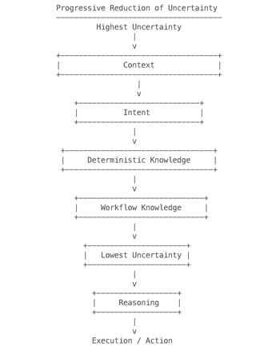
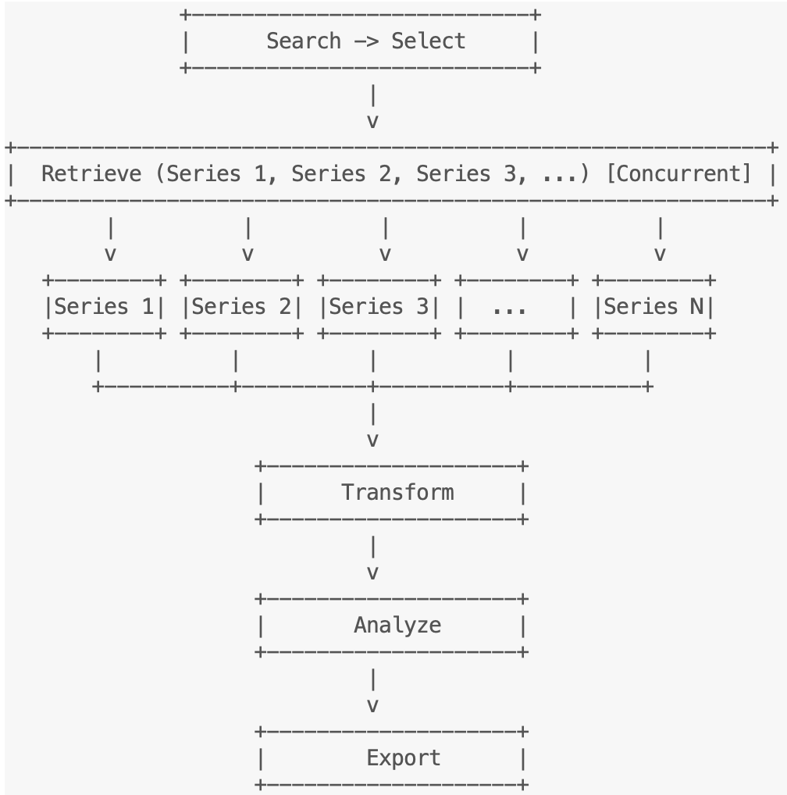

# Repository Architecture for Agentic Systems

*Progressive Agent Onboarding Through Deterministic Discovery and Retrieval*

## Abstract

As software systems become increasingly accessible to autonomous agents, the architecture of software repositories has emerged as an important factor in agent performance. Contemporary approaches largely concentrate intelligence before execution through larger language models, expanded context windows, retrieval-augmented generation (RAG), knowledge graphs, and protocol layers that help agents interpret existing software. While these techniques improve an agent’s ability to reason about software, they generally assume that repositories themselves remain passive collections of source code and documentation.

This paper proposes **Repository Architecture for Agentic Systems (RAAS)**, an architectural pattern that treats the repository itself as an active participant in agent onboarding and execution. Rather than relying on increasingly capable models to infer repository structure, deterministic knowledge is organized into progressively discoverable artifacts including command metadata, workflow contracts, semantic indexes, and structured documentation. Agents retrieve only the deterministic information required for the current task before applying probabilistic reasoning, reducing ambiguity, minimizing context consumption, and reserving language-model inference for decisions that genuinely require intelligence.

The proposed architecture draws heavily from the composability principles established by the Unix philosophy. Small, deterministic command-line interfaces become semantic building blocks that can be incrementally discovered and composed rather than opaque executables requiring extensive prior knowledge. In this model, repositories evolve from passive collections of files into self-describing systems that actively guide both human developers and autonomous agents through deterministic discovery before execution.

This paper defines the architectural principles of Repository Architecture for Agentic Systems, introduces **Progressive Agent Onboarding** as one implementation pattern within the architecture, discusses its relationship to retrieval-based systems and emerging agent protocols, and presents a reference implementation demonstrating the feasibility of the approach. Although the implementation described is command-line oriented, the architectural pattern is intended to apply broadly to agentic software systems that seek to reduce uncertainty through repository design rather than increasingly sophisticated model reasoning.

## Introduction

The emergence of large language models transformed artificial intelligence from a system that primarily generated text into one capable of operating software. Modern agentic systems routinely invoke application programming interfaces (APIs), execute command-line programs, navigate graphical user interfaces, and interact with purpose-built tool interfaces such as those exposed through the Model Context Protocol (MCP). As these capabilities have matured, software execution has become a first-class operation for autonomous agents rather than an experimental extension of natural language processing.

Early generations of agentic systems relied heavily on knowledge embedded within the underlying language models. As software ecosystems evolved more rapidly than model training cycles, architectures increasingly shifted toward external sources of knowledge through retrieval-augmented generation (RAG), semantic indexes, knowledge graphs, documentation repositories, and machine-readable tool contracts. These approaches significantly improved an agent’s ability to understand existing software by concentrating intelligence before execution.

While considerable research has focused on improving models and the systems that supply them with context, comparatively little attention has been given to the architecture of the software repositories themselves. In most contemporary systems, repositories remain passive collections of source code and documentation designed primarily for human consumption. Autonomous agents are expected to infer repository structure, discover workflows, and interpret implementation details using increasingly sophisticated reasoning.

This paper argues that repository architecture should itself become an active participant in agentic software systems. Rather than relying exclusively on more capable models or larger retrieval systems, deterministic knowledge can be organized into progressively discoverable architectural components that guide autonomous agents before probabilistic reasoning is required. By treating repositories as progressive self-describing systems instead of passive artifacts, deterministic understanding can be extended further into the execution pipeline, allowing language models to focus on decisions that genuinely require intelligence. Software should not merely be executable—it should be progressively understandable.

The remainder of this paper introduces Repository Architecture for Agentic Systems as an architectural pattern for organizing software repositories around deterministic discovery, progressive retrieval, and composable execution. It further introduces Progressive Agent Onboarding as one implementation pattern within this architecture and demonstrates its feasibility through an open-source reference implementation.

## Historical Foundations

The architectural patterns presented in this paper did not emerge in isolation. Many of the underlying principles have existed in software engineering for decades, most notably within the Unix philosophy, where small, deterministic, composable tools became the foundation of robust software ecosystems. What has changed is not the value of these principles, but the primary consumer of software. As autonomous agents become first-class participants in software engineering, longstanding ideas such as composability, explicit interfaces, and progressive discovery acquire renewed architectural significance.

### The Unix Philosophy

The Unix philosophy was developed to improve software composition by human operators, long before autonomous agents became practical. Principles such as “do one thing well,” explicit interfaces, composability, and textual interoperability were intended to simplify human reasoning about software systems. Yet these same properties also reduce ambiguity for autonomous agents. Small deterministic commands, composed through well-defined contracts, are inherently easier for an agent to discover, understand, and combine than large monolithic applications. What began as a philosophy for human productivity has become an unexpectedly effective architectural model for machine understanding.

### Composability as an Architectural Primitive

The enduring contribution of the Unix philosophy is not the command-line interface itself, but the architectural concept of deterministic composition. Unix commands were intentionally designed as small, single-purpose components with explicit inputs, predictable outputs, and well-defined behavior. As command-line interfaces evolved from collections of independent utilities into hierarchical command structures, this principle did not change. Composability simply moved from shell pipelines into the organization of commands and subcommands within a single application. Whether composition occurs between independent executables or between related commands inside a modern CLI, each component continues to expose a stable contract that can be predictably combined with others. Complex software systems can therefore be constructed by composing deterministic building blocks rather than developing monolithic applications.

This principle established composability as an architectural primitive. Individual commands remained simple and deterministic, while increasingly sophisticated behavior emerged from their composition. The intelligence of the system resided not within any individual component, but in the orchestration of many deterministic components working together.

> By separating complexity from individual components and placing it within their composition, software systems could scale in capability without proportionally increasing the complexity of the components themselves.

### A New Consumer of Software

Historically, software has been written to be consumed by either human operators or other software through explicit programming interfaces. Both relationships were intentionally defined through embedded documentation, such as help systems and manual pages, and externally through repository documentation, specifications, and interface contracts.

Autonomous software introduces a third consumer: software capable of discovering, understanding, and operating other software with varying degrees of independence. Regardless of the underlying implementation, this changes an important architectural assumption. Software repositories are no longer consumed exclusively by humans, but increasingly by systems that must independently discover deterministic behavior before execution.

Repository content optimized for human consumption is not necessarily optimized for autonomous consumers. Agents frequently expend computational effort discovering, reorganizing, and persisting information that already exists within the repository but is organized primarily for human understanding. This repeated transformation incurs measurable computational and token costs while introducing opportunities for ambiguity and inconsistency.

This paper argues that repository architecture should evolve to recognize autonomous software as a first-class consumer. By organizing deterministic knowledge into predictable and progressively discoverable architectural components, repositories can actively participate in software understanding rather than serving solely as passive collections of source code and documentation.

## Terminology

This paper introduces several architectural terms that are used consistently throughout the remainder of the discussion. These terms describe concepts within Repository Architecture for Agentic Systems and are intended to distinguish architectural components from their implementation. Throughout this paper, the emphasis is placed on the purpose of an architectural element rather than the specific file format or technology used to represent it.

> **Autonomous Consumer** - Software capable of independently discovering, understanding, and operating software repositories with varying degrees of autonomy. Autonomous consumers include AI agents, automation systems, and future software capable of reasoning about software artifacts without direct human intervention.
>
> **Repository Architecture** -The deliberate organization of software artifacts to optimize deterministic discovery, progressive understanding, and composability for autonomous software consumers while preserving traditional repository organization for human developers.
>
> **Deterministic Knowledge** - Knowledge whose correct interpretation should not require inference, creativity, judgment, or probabilistic reasoning. Deterministic knowledge represents stable facts about a software system that should be discoverable explicitly rather than repeatedly inferred.
>
> **Deterministic Artifact** - A repository artifact whose purpose is to communicate stable, machine-discoverable knowledge without requiring interpretation. Examples include command metadata, workflow contracts, semantic indexes, interface contracts, and repository topology.
>
> **Progressive Discovery** - The incremental retrieval of deterministic knowledge in the order required to reduce uncertainty before execution. Progressive discovery avoids loading unnecessary context by exposing only the information required for the current stage of understanding.
>
> **Workflow Contract** -A deterministic artifact that describes the required sequence of operations, inputs, outputs, dependencies, constraints, and optimization opportunities necessary to perform a specific operation. Workflow contracts define not only *how* a task should be performed, but also *why* a particular sequence is required and *where* equivalent or more efficient deterministic execution paths exist. They communicate deterministic execution without embedding implementation details.
>
> **Semantic Topic Index** - A deterministic artifact that organizes repository capabilities into discoverable conceptual categories, enabling autonomous consumers to navigate repository knowledge without exhaustive search.
>
> **Progressive Understanding** - The process by which autonomous consumers transition from repository discovery to deterministic understanding before applying reasoning. Progressive understanding seeks to maximize explicit knowledge before probabilistic inference becomes necessary.

## Repository Architecture

Repository Architecture is the deliberate organization of software artifacts to optimize discoverability, deterministic understanding, and composability for all software consumers. Unlike traditional repository organization, which primarily serves human developers, Repository Architecture recognizes autonomous software as a first-class consumer and organizes deterministic knowledge to minimize ambiguity before execution.

Repository Architecture is not an effort to standardize documentation or replace human-oriented repository organization. Instead, it introduces an additional architectural layer that exposes deterministic knowledge through progressively discoverable artifacts. Human documentation continues to serve human readers, while repository architecture provides explicit semantic structures that autonomous consumers can discover, retrieve, and compose without repeatedly reconstructing repository knowledge.

### Repository Scope

The purpose of Repository Architecture is not to duplicate information already present within a software repository. Instead, it identifies deterministic knowledge that autonomous consumers repeatedly rediscover and promotes that knowledge into explicit architectural artifacts. Information whose interpretation depends upon context, judgment, or creativity remains within traditional documentation or source code, while information that is stable, repeatable, and discoverable becomes part of the repository architecture.

Repository Architecture typically includes:

- Semantic topic indexes

- Command metadata

- Workflow contracts

- Deterministic examples

- Cross-reference relationships

- Progressive discovery paths

- Interface contracts

- Repository topology

Repository Architecture intentionally excludes:

- Source code implementation

- Narrative documentation

- Design discussions

- Historical context

- Creative guidance

- Opinionated best practices

As autonomous software becomes increasingly separated from both the underlying data and the software it ultimately operates, repositories must provide deterministic context that allows consumers to progressively eliminate uncertainty before execution. Repository Architecture exists to expose that deterministic knowledge explicitly, enabling autonomous consumers to defer reasoning until deterministic discovery has been exhausted.

**Reducing Uncertainty Before Execution**

The central premise of Repository Architecture for Agentic Systems is straightforward: uncertainty should be reduced before reasoning begins. Every software repository contains information that ranges from objective facts to decisions requiring interpretation and judgment. Repository Architecture exists to expose objective, stable knowledge as explicit architectural artifacts, allowing autonomous consumers to discover what is already known before reasoning about what is not.

The progressive reduction of uncertainty provides a practical design framework for deciding what belongs within Repository Architecture. Information that can be expressed explicitly should be represented through deterministic artifacts. Information that depends upon judgment, tradeoffs, or creativity should remain the responsibility of the autonomous consumer.

This leads to a simple engineering principle:

> Push deterministic discovery as far as practical before reasoning begins.

Repository Architecture does not seek to eliminate reasoning. Rather, it seeks to preserve reasoning for the problems that genuinely require it. By progressively reducing uncertainty before execution, autonomous consumers can devote computational effort to solving new problems instead of repeatedly rediscovering stable characteristics of the software system.



Uncertainty is continuously reduced at every stage.


### Context

Context establishes the operational environment in which repository capabilities should be understood. It defines the domain, intended users, problem space, and assumptions under which deterministic knowledge and workflows are applied. Context reduces ambiguity by helping autonomous consumers understand *where* they are before deciding *what* to do.

Examples include:

- Domain (macroeconomics)

- Intended audience (economists)

- Data source (Federal Reserve Economic Data)

- Operational environment (production systems)

- Primary use cases

- Architectural assumptions

### Intent

Intent defines the objective the autonomous consumer is attempting to achieve within the established context. Where **Context** answers the question *“Where am I?”*, **Intent** answers *“What am I trying to accomplish?”* While the context of a repository is generally stable, intent varies with every interaction and serves as the primary mechanism for selecting the deterministic knowledge and workflow required to complete a task.

Intent is not an implementation detail, nor is it a workflow. It describes the desired outcome rather than the means of achieving it. Two consumers operating within the same repository may share identical context while pursuing entirely different objectives. One consumer may seek to retrieve historical inflation data, another to compare employment trends, and a third to export data for external analysis. The context remains unchanged; only the intent differs.

Repository Architecture uses intent to progressively narrow the deterministic solution space presented to the autonomous consumer. Rather than exposing every available command, workflow, or capability, the repository provides only the deterministic artifacts relevant to the stated objective. This reduces ambiguity, minimizes unnecessary discovery, and allows subsequent reasoning to occur within a well-defined operational scope.

Examples of repository intent include:

- Retrieve historical economic data.

- Compare two or more economic indicators.

- Analyze production change impacts.

- Export transformed data for reporting.

- Publish processed results.

- Validate repository configuration.

- Install a workflow package.

- Search repository capabilities.

Intent acts as the bridge between orientation and execution. Once context establishes the operational environment and intent establishes the desired outcome, deterministic knowledge and workflow contracts can guide the autonomous consumer toward successful execution with minimal inference.

### Deterministic Knowledge

Deterministic knowledge exists to eliminate uncertainty rather than teach concepts. It communicates objective facts about a software system that should not require interpretation, inference, or creativity. Its purpose is not to persuade an architect, educate a developer on a computing concept, or justify why a particular approach should be adopted. Instead, deterministic knowledge provides explicit guidance for autonomous consumers that have already selected a software system and now require the most direct and reliable path toward successful execution.

Deterministic knowledge is framed by context and intent but remains factual in nature. Context explains *when* information applies, while intent explains *why* the information is relevant to the current objective. Neither changes the underlying facts; they simply reduce ambiguity by ensuring the correct deterministic knowledge is presented at the appropriate stage of discovery.

In Repository Architecture, deterministic knowledge serves as the connective tissue between autonomous consumers and software capabilities. Rather than repeatedly reconstructing repository structure, command behavior, or execution requirements, consumers retrieve explicit deterministic artifacts that progressively eliminate uncertainty before reasoning becomes necessary.

| Deterministic Knowledge | Why It Is Deterministic |
|---|---|
| Command name | Stable identifier |
| Required arguments | Explicit requirement |
| Output schema | Contract |
| Authentication requirements | Fact |
| Execution order | Workflow constraint |
| Exit codes | Defined behavior |
| Dependencies | Repository fact |
| Supported platforms | Repository fact |

| Not Deterministic Knowledge | Why |
|---|---|
| Which architecture is better | Requires judgment |
| Should I use Redis? | Tradeoff |
| Is this API elegant? | Opinion |
| How should I redesign this workflow? | Creativity |
| Which implementation is best? | Context-dependent reasoning |

### Workflow Knowledge

Workflow knowledge extends deterministic knowledge by organizing facts into deterministic sequences. Where deterministic knowledge answers the question **“What?”**, workflow knowledge answers the question **“In what order?”** In addition to sequencing operations, workflow knowledge communicates dependencies, constraints, formatting requirements, and deterministic optimization opportunities that govern successful execution.

A simple retrieval workflow might be represented as:

> Search → Select → Retrieve → Transform → Analyze → Export

The sequence itself is deterministic, but workflow knowledge extends beyond the visible order of operations by exposing dependencies between individual steps. For example:

> **Fact:** Retrieve **must** produce JSONL output because Transform accepts JSONL as its required input.

This dependency is not immediately obvious from the workflow itself, yet it is entirely deterministic. Exposing these relationships eliminates unnecessary inference while reducing execution errors.

Workflow knowledge also communicates deterministic optimization opportunities. Consider the simplified workflow:

> Search → Select → Retrieve → Export

Exporting raw data enables subsequent iterative processing against local data, allowing repeated operations such as:

> Transform → Analyze → Sub-export

to occur without repeatedly retrieving the original data.

Likewise, rather than executing the complete workflow multiple times for related datasets:

> (Search → Select → Retrieve → Transform → Analyze → Export) × N

workflow knowledge may identify an equivalent but more efficient execution strategy:



Both workflows produce identical deterministic results, yet the latter reduces redundant operations and exposes opportunities for parallel execution.

Order of operations has always been fundamental to deterministic systems. Mathematical expressions, compiler pipelines, database transactions, manufacturing processes, and software workflows all depend upon correct sequencing to produce reliable outcomes. Repository Architecture promotes this sequencing from implicit documentation into explicit deterministic artifacts, allowing autonomous consumers to execute known workflows without rediscovering their structure.

### Reasoning

Reasoning begins where deterministic discovery ends. Once deterministic knowledge, workflow knowledge, and semantic knowledge have been exhausted, the remaining questions require interpretation rather than retrieval. These questions involve tradeoffs, uncertainty, incomplete information, competing objectives, and novel situations that cannot be resolved through deterministic artifacts alone.

Examples include:

- Which workflow best satisfies the user’s objective?

- Should performance be prioritized over simplicity?

- Is additional information required?

- Can existing workflows be composed into a new solution?

- Does this situation require a previously unknown approach?

Repository Architecture intentionally avoids encoding these decisions. Instead, it seeks to maximize the deterministic information available so that autonomous consumers devote reasoning to genuinely novel problems rather than reconstructing repository knowledge.

### Progressive Discovery

One of the recurring observations made while developing Repository Architecture was that autonomous consumers rarely need to understand an entire repository. They need only enough deterministic knowledge to answer the next question.

Repository Architecture therefore avoids presenting a repository as a monolithic body of documentation. Instead, knowledge is organized so that discovery occurs progressively. Context establishes where the consumer is operating. Intent establishes what the consumer is attempting to accomplish. Deterministic knowledge answers factual questions, while workflow knowledge answers procedural ones. Only after deterministic discovery has been exhausted does reasoning become necessary.

The result is a repository that naturally guides an autonomous consumer through progressively smaller uncertainty rather than requiring the consumer to build a complete mental model before beginning work.

## Repository Components

The previous chapters introduced the principles behind Repository Architecture and the progressive reduction of uncertainty. This chapter describes the architectural components that realize those principles. These components are not implementation-specific file formats, but logical artifacts that collectively enable a repository to participate in the onboarding of an autonomous consumer.

Individual implementations may choose different representations, including JSON, YAML, Markdown, databases, or graph structures. The architectural components, however, remain consistent regardless of their physical representation.

Together these components create a repository that is progressively understandable rather than merely executable.

### Topic Index

The Topic Index serves as the entry point into Repository Architecture. Rather than exposing commands alphabetically or according to implementation structure, the Topic Index organizes repository capabilities according to problem domains and user objectives.

Its purpose is orientation.

Before an autonomous consumer can determine *how* to perform an operation, it must first determine *whether* the repository contains the required capability. The Topic Index provides this initial map by exposing functional areas rather than implementation details.

A Topic Index may organize capabilities by:

- Functional domain

- User intent

- Workflow category

- Repository capability

- Operational role

The Topic Index intentionally avoids implementation details. It answers the question:

**What can this repository help me accomplish?**

rather than

**Which command should I execute?**

### Onboarding Publications

Once an autonomous consumer selects a capability from the Topic Index, Repository Architecture transitions from discovery to understanding through an onboarding publication.

An onboarding publication is the primary architectural artifact of Repository Architecture. It assembles the deterministic knowledge required for a single capability into a structured publication optimized for autonomous consumption.

Unlike traditional reference documentation, an onboarding publication is not intended to describe every aspect of a command. Its purpose is to reduce uncertainty by progressively presenting the information required to understand and correctly use a capability.

An onboarding publication typically includes:

- Context

- Intent

- Purpose

- Mental model

- Deterministic command knowledge

- Workflow guidance

- Input and output contracts

- Operational considerations

- Related capabilities

- Verified examples

Each section answers a specific question in the autonomous consumer’s discovery process, allowing the repository to guide understanding before reasoning begins.

### Workflow Contracts

Workflow Contracts describe how deterministic capabilities compose to accomplish a larger objective.

Where an onboarding publication explains an individual capability, a Workflow Contract explains how multiple capabilities cooperate.

A Workflow Contract extends beyond execution order by documenting dependencies, constraints, optimization opportunities, concurrency, and equivalent deterministic execution paths.

Rather than requiring an autonomous consumer to infer orchestration from examples or source code, Workflow Contracts expose orchestration explicitly as a first-class architectural artifact.

Canonical workflows, concurrent workflows, iterative workflows, and optimized workflows may all satisfy the same contract while producing identical deterministic results.

### Reference Material

Repository Architecture does not replace traditional documentation.

Narrative documentation continues to serve human readers by providing tutorials, conceptual explanations, design rationale, and historical context. These materials remain an essential part of the repository but serve a different purpose than deterministic onboarding artifacts.

Repository Architecture therefore separates deterministic onboarding from explanatory documentation.

Autonomous consumers primarily consume onboarding publications and workflow contracts.

Human readers continue to benefit from books, tutorials, design discussions, and other forms of narrative documentation.

Both forms of documentation coexist within the same repository while serving different consumers and different stages of understanding.

## Architectural Principles

The preceding chapters introduced Repository Architecture through its terminology, its structural components, and its relationship to the Unix philosophy of composability. The following principles distill that discussion into a compact set of architectural commitments. A repository need not satisfy every principle to benefit from Repository Architecture, but each principle clarifies the reasoning behind a specific architectural decision.

### Principle 1

**Software should not merely be executable—it should be progressively understandable.**

This principle is the thesis of Repository Architecture and the organizing idea behind every component described in Repository Components. Executability has long been the only architectural property that mattered to a piece of software: a program either runs correctly or it does not. Autonomous consumers introduce a second property that traditional architecture never had to optimize for—the rate at which a repository allows its own capabilities, constraints, and correct usage to be discovered before a single command is invoked. A repository can be fully executable and still be architecturally opaque to an agent that must repeatedly infer its structure from source code and prose intended for human readers.

Understandability, in this sense, is not binary. An autonomous consumer does not require complete knowledge of a repository before acting; it requires just enough knowledge to resolve its current uncertainty, as described in the discussion of Progressive Discovery. Progressive understandability therefore describes a repository’s capacity to expose increasing specificity on demand—first orienting the consumer through Context and Intent, then supplying Deterministic Knowledge, then Workflow Knowledge, and only then yielding to Reasoning. A repository is progressively understandable to the degree that each stage of this sequence can be satisfied without requiring the consumer to load the remainder.

This reframing has practical consequences for repository design. Documentation, command interfaces, and workflow definitions can each be evaluated not only by their accuracy but by how much uncertainty they resolve per unit of context consumed. A well-designed onboarding publication answers the question an autonomous consumer is actually asking; a poorly designed one requires the consumer to read past irrelevant material to extract the deterministic fact it needs. Progressive understandability is therefore best understood as an efficiency property of discovery, not merely a completeness property of documentation.

### Principle 2

**Deterministic knowledge should reside in software rather than prompts whenever practical.**

Prompts and system instructions are a convenient place to encode facts about a repository, but they are also the least durable. A fact stated in a prompt must be restated in every session, is invisible to any consumer that was not given that particular prompt, and drifts out of alignment with the software the moment the software changes without a corresponding update to the instructions that describe it. Deterministic knowledge, as defined earlier in this paper, does not require inference or judgment to interpret correctly—which means it can be represented directly within the repository as a Deterministic Artifact, discoverable by any autonomous consumer regardless of how that consumer was prompted or configured.

Moving deterministic knowledge out of prompts and into the repository does not eliminate the need for prompts; it changes what prompts are responsible for. A prompt can still direct an autonomous consumer’s attention, establish its objective, or supply context specific to a session. What it should not be asked to do is carry facts that are properties of the software itself—command syntax, required output formats, dependency relationships, and workflow ordering all belong in the repository, where they remain accurate as the software evolves and available to every consumer that discovers them, rather than only the one that happened to receive the correct prompt.

### Principle 3

**Reasoning should begin only after deterministic discovery has been exhausted.**

This principle restates, as an architectural commitment, the boundary established in the discussion of Reasoning: deterministic discovery and probabilistic reasoning are not interchangeable, and an architecture that allows reasoning to substitute for discovery will consume inference on problems that a well-organized repository could have answered directly. Every question resolved through Context, Intent, Deterministic Knowledge, or Workflow Knowledge is a question that does not need to be resolved through inference, and every unnecessary inference is an opportunity for ambiguity, inconsistency, or error to enter an otherwise deterministic process.

Enforcing this ordering does not diminish the role of reasoning; it protects it. An autonomous consumer that reasons before it discovers is reasoning about incomplete or assumed information, and its conclusions inherit that uncertainty regardless of how capable the underlying model is. By contrast, an autonomous consumer that exhausts deterministic discovery first brings reasoning to bear only on the questions identified in the discussion of Reasoning—genuine tradeoffs, incomplete information, and novel situations—where interpretation is actually required and where model capability is best spent.

### Principle 4

**Repositories should actively explain themselves.**

Traditional repositories are passive: they contain the information an autonomous consumer needs, but that information must be located, assembled, and interpreted by the consumer itself, typically through some combination of source code inspection, documentation search, and inference. Repository Components describes the architectural components—Topic Indexes, Onboarding Publications, Workflow Contracts, and Reference Material—that allow a repository to instead take an active role in this process, presenting deterministic knowledge in the order and specificity an autonomous consumer requires rather than waiting to be interpreted.

A repository that actively explains itself does not require a more capable consumer to be understood correctly; it requires better architecture. This distinction matters because it shifts the burden of reducing ambiguity from the model, where it must be repeatedly re-solved by inference at execution time, to the repository, where it can be solved once and reused by every autonomous consumer that discovers it thereafter.

### Principle 5

**Commands are semantic contracts, not merely executables.**

The discussion of composability in Historical Foundations established that Unix commands were valuable not simply because they executed correctly, but because their inputs, outputs, and behavior were explicit enough to be composed predictably by other commands and, ultimately, by other people. Repository Architecture extends this property to autonomous consumers by treating a command’s interface—not its implementation—as the unit of understanding. A command’s true architectural value lies in what it promises: the shape of its input, the shape of its output, the side effects it produces, and the conditions under which it succeeds or fails.

Treating commands as semantic contracts means that an autonomous consumer should be able to determine what a command does and how it composes with other commands without reading its implementation. This is the purpose of the deterministic command knowledge described as part of an Onboarding Publication: it exposes the contract directly, allowing the executable itself to remain an implementation detail that the consumer need not inspect in order to use the command correctly.

### Principle 6

**Intelligence should compose deterministic building blocks rather than replace them.**

This principle is the direct architectural descendant of the observation, introduced in Historical Foundations, that Unix systems achieved sophisticated behavior not by making individual commands more intelligent, but by composing simple, deterministic commands into larger pipelines. The intelligence of the system lived in the composition, not the components. Repository Architecture applies the same logic to autonomous consumers: an agent’s reasoning is most valuable when it is deciding how to combine existing deterministic capabilities to solve a problem, and least valuable when it is used to reconstruct a capability that a deterministic artifact could have described directly.

This principle also functions as a caution against a common failure mode in agentic system design, in which increasingly capable models are used to compensate for repositories that fail to expose their own structure. That approach treats intelligence as a substitute for architecture rather than a complement to it, and it scales poorly: the cost of inferring the same deterministic facts is paid again by every session and every consumer. Composing deterministic building blocks, by contrast, allows the sophistication of the resulting behavior to grow without requiring the underlying components—or the model interpreting them—to grow more complex.

### Principle 7

**Repository Architecture reduces autonomous drift by establishing context before intent, intent before deterministic knowledge, and deterministic knowledge before execution.**

The preceding six principles describe properties that a repository or its components should hold. This seventh principle describes the order in which those properties should be applied. The sequence—Context, then Intent, then Deterministic Knowledge, then Workflow Knowledge, then execution—was introduced in the discussion of Progressive Discovery, and it is not incidental. Each stage narrows the space of valid interpretations available to the next: Context establishes where an autonomous consumer is operating, Intent establishes what it is attempting to accomplish within that context, and only then can the correct deterministic knowledge and workflow be selected.

Autonomous drift describes what happens when this ordering is violated—when an autonomous consumer selects a workflow, retrieves knowledge, or takes action before its context and intent have been correctly established. Because each later stage depends on the stages before it, an error introduced early in the sequence compounds rather than self-corrects; a consumer operating from a misunderstood context will continue to make locally reasonable decisions that are globally wrong. Enforcing the sequence does not guarantee correct outcomes, but it ensures that when an autonomous consumer does act, it does so from a foundation of established context and intent rather than from assumption.

Together, these seven principles do not prescribe a specific file format, protocol, or implementation technology. They describe an architectural posture: repositories that expose deterministic knowledge progressively, in a defined order, so that reasoning is reserved for the problems that genuinely require it. The remainder of this paper examines how this posture relates to existing approaches and how it has been applied in practice.

## Relationship to Existing Approaches

Repository Architecture does not emerge in a vacuum. Retrieval-augmented generation, knowledge graphs, and the Model Context Protocol each address a related problem: how an autonomous consumer comes to understand and operate software it did not author. This section positions Repository Architecture relative to each of these approaches. The relationship between Repository Architecture and traditional, human-oriented documentation is addressed separately in Reference Material; this section instead considers three approaches aimed specifically at improving how autonomous consumers understand and act on software.

The comparison that follows is not an argument that Repository Architecture replaces any of these approaches. Each solves a real problem that Repository Architecture does not attempt to solve itself. The distinction that matters is architectural: where in the pipeline each approach concentrates its effort, and what kind of uncertainty each is designed to reduce.

### Retrieval-Augmented Generation

Retrieval-augmented generation addresses a real limitation of language models: a model's training data is fixed, while the software and documentation it must reason about continues to change. RAG closes this gap by retrieving relevant material—typically ranked by semantic similarity to a query—and inserting it into the model's context at inference time. This allows an autonomous consumer to ground its reasoning in current, external information rather than relying solely on what the model learned during training.

RAG and Repository Architecture solve different problems. RAG treats a corpus as an undifferentiated body of text to be searched; it does not distinguish deterministic facts from interpretive narrative, and a similarity search has no way to know that a command's required argument list is a stable fact while a design discussion is a matter of judgment. Every query is answered by searching the corpus anew, which means RAG has no mechanism analogous to Context or Intent: nothing in the architecture narrows what is retrieved based on where the consumer is operating or what it is trying to accomplish, beyond whatever similarity the query text happens to share with the underlying documents. And because RAG retrieves prose written primarily for human readers, the autonomous consumer is frequently left to extract a deterministic fact—a required flag, an output format, an execution order—through inference over retrieved narrative text, which is precisely the unnecessary inference that reasoning should be reserved to avoid.

RAG's genuine strength is that it works without requiring a repository to be restructured, and it remains the right tool for exactly the material Repository Architecture excludes: design discussions, historical context, and other narrative documentation whose correct interpretation depends on judgment rather than retrieval. Repository Architecture and RAG are therefore complementary rather than competing: Progressive Discovery narrows what an autonomous consumer needs before any search is necessary, reducing how much must be retrieved at all, while RAG remains well suited to the reasoning-stage material that Repository Architecture deliberately leaves outside its scope.

### Knowledge Graphs

Knowledge graphs represent a codebase or domain as explicit entities and relationships—functions that call other functions, services that depend on other services, classes that extend other classes—typically queried through graph traversal rather than similarity search. Of the three approaches considered here, knowledge graphs are the closest in spirit to Repository Architecture: an edge in a knowledge graph either exists or it does not, which is the same deterministic character that defines Deterministic Knowledge in this paper.

The difference lies in what a knowledge graph represents and how it comes to exist. Knowledge graphs typically encode structural facts about a system as it already is, most often extracted after the fact through static analysis or automated inference. They answer questions about relationships—what depends on what—but a graph of relationships does not by itself communicate Context, Intent, or Workflow Knowledge. Knowing that a command depends on another command is not the same as knowing why that dependency exists, in what order a consumer should discover it, or whether it is even relevant to the consumer's current objective. A knowledge graph can be queried exhaustively, but exhaustive query capability is not the same as progressive discovery: nothing in the graph itself indicates which edges matter first.

There is also a provenance difference worth noting. Because knowledge graphs are typically generated by an extraction pipeline rather than authored directly, their accuracy is bounded by that pipeline's correctness, and they capture structural fact without necessarily capturing authorial intent. A Workflow Contract that states a dependency exists because of a specific formatting requirement carries information that a call graph edge alone does not.

These differences point toward a complementary role rather than a competing one. Several of the artifact types Repository Architecture describes—cross-reference relationships and repository topology among them—are naturally graph-shaped, and a knowledge graph is a reasonable implementation substrate for that portion of Repository Architecture. Repository Architecture is deliberately agnostic about physical representation, as established in the discussion of Repository Components; it specifies what should be captured and why it should be discoverable in a given order, not the data structure used to store it.

### Model Context Protocol

The Model Context Protocol standardizes how an autonomous consumer discovers and invokes tools exposed by a server: a consistent, machine-readable contract for a tool's name, input schema, output schema, and description, independent of which server implements it. Of the three approaches considered here, MCP is the closest architectural sibling to Repository Architecture, because a well-formed MCP tool definition is itself a Deterministic Artifact—it exposes a command's interface as a semantic contract rather than requiring an autonomous consumer to infer that contract from implementation, which is precisely the property described in Principle 5.

The difference is one of scope rather than philosophy. MCP standardizes the interface layer: how a consumer connects to a capability and what a valid invocation looks like. It does not, by itself, specify what Repository Architecture requires above that layer—a Topic Index that orients a consumer among many tools before any one of them is selected, Workflow Contracts that describe how tools compose and depend on one another, or a Context and Intent stage that narrows which tools are even relevant to a given objective. An MCP server can expose a large number of tools as a flat, well-documented list, and every individual tool definition can be a correct Deterministic Artifact, while the collection as a whole remains exactly as undiscoverable as a repository with excellent command-line help text and no onboarding path. As the number of tools exposed by a server grows, this flat-list problem becomes the same discovery problem Repository Architecture is designed to address—the well-formed interface contract does not, on its own, tell a consumer which of forty tools to reach for, or in what order.

Repository Architecture and MCP therefore compose naturally rather than competing for the same role. MCP is a plausible transport through which an autonomous consumer ultimately invokes the capabilities that Repository Architecture organizes; Repository Architecture is the discovery structure that determines when and why a given MCP tool should be reached for in the first place. Neither requires the other, but a repository that exposes its Deterministic Artifacts and Workflow Contracts through MCP, organized by a Topic Index and staged by Context and Intent, satisfies both architectures at once.

### Complementary Architectural Roles

Each of these three approaches concentrates its effort at a different point in the pipeline between an autonomous consumer and the software it must operate. Retrieval-augmented generation concentrates intelligence at retrieval time, compensating for unstructured content through similarity search. Knowledge graphs concentrate structure after the fact, extracting relational facts from a system once it already exists. The Model Context Protocol concentrates standardization at the invocation boundary, making individual capabilities discoverable and callable in a consistent way. Repository Architecture concentrates architecture upstream of all three, in the repository itself, organizing what should be exposed, in what order, and why—independent of the retrieval mechanism, the storage structure, or the invocation transport ultimately used.

| Approach | What it optimizes | What it leaves unaddressed |
|---|---|---|
| Retrieval-Augmented Generation | Grounding reasoning in current, external text via similarity search | Distinguishing deterministic fact from narrative; staged, intent-driven discovery |
| Knowledge Graphs | Explicit, queryable relationships between system entities | Discovery ordering, authorial intent, why a relationship exists |
| Model Context Protocol | A consistent, machine-readable contract for invoking a capability | Orientation across many tools; how capabilities compose; when a tool is relevant |
| Repository Architecture | Progressive, intent-driven discovery of deterministic knowledge before execution | Retrieval mechanism, storage structure, and invocation transport—deliberately left unspecified |

None of these approaches is subordinate to another; each addresses a real problem the others do not. A repository built according to Repository Architecture is not in tension with any of them—its excluded narrative content remains a legitimate target for retrieval-augmented generation, its cross-reference relationships and topology can be implemented as a knowledge graph, and its Deterministic Artifacts and Workflow Contracts can be served through the Model Context Protocol. This mirrors, at the level of architectural approaches, the same principle Repository Architecture applies to commands: intelligence—wherever it is concentrated—should compose with deterministic structure rather than substitute for it.

## Case Study: RESERVE

### Project Overview

reserve is a command-line tool, written in Go, that fetches, caches, transforms, and analyzes economic time series from the Federal Reserve Economic Data (FRED®) API. It is an unofficial, independently developed client: it is not affiliated with, endorsed by, or produced by the Federal Reserve Bank of St. Louis, which operates FRED and holds the FRED® mark. reserve was written to fill a gap in that ecosystem—prior access to FRED data was largely limited to the web interface, ad hoc scripts, or language-specific libraries, rather than a dedicated, cross-platform command-line tool that a user or an automated pipeline could install as a single binary and run the same way on Linux, macOS, or Windows.

Rather than a thin wrapper around a handful of API endpoints, reserve is organized as a complete data toolset for FRED: discovery commands (`search`, `series`, `category`, `tag`, `release`, `source`, `meta`) for finding the right series, retrieval commands (`obs`, `fetch`) for pulling observations live or from a local cache, and a pipeline of transformation and analysis commands (`transform`, `window`, `analyze`, `chart`) for reshaping and interpreting the resulting time series—all communicating through the same Result envelope and JSONL pipeline model discussed in Historical Foundations. As of this writing it exposes twenty-one top-level commands in total.

The choice of domain is not incidental. Macroeconomic data published through FRED is exactly the kind of material this paper calls Deterministic Knowledge: a series identifier, its date range, its units, its update schedule, and its historical values are stable facts that do not require interpretation to retrieve correctly. At the same time, macroeconomics as a discipline does not stop being interesting once the data has been retrieved—deciding which indicators bear on a given question, how to read a divergence between two series, or whether an apparent trend reflects a genuine regime change is real analytical work that no amount of deterministic retrieval settles on its own. FRED's vast, well-structured, deterministic data paired with a discipline that demands real reasoning makes macroeconomic data an unusually clear setting for the distinction this paper argues for: an autonomous consumer that spends no effort rediscovering what a series contains is one whose reasoning is left entirely for what the data means.

reserve is presented here as a case study because it is a real, in-production tool rather than an example constructed to illustrate this paper's claims. Its onboarding system is exposed through a dedicated `reserve onboard` command, which serves machine-readable documentation to any autonomous consumer that requests it, organized around the same problem this paper addresses: how an agent comes to understand a piece of software it did not write, without exhausting its context window or guessing at behavior it could instead discover.

The remainder of this section walks through how that onboarding system is organized (Repository Layout), what an actual onboarding session looks like from an autonomous consumer's perspective (Agent Onboarding Workflow), what can be said about the resulting reduction in context consumption (Measured Context Reduction), and what building it revealed that this paper's architecture, on its own, would not have predicted (Lessons Learned).

### Repository Layout

reserve is a Cobra-based CLI, and Cobra generates conventional human-facing help (`--help`) directly from each command's `Use`, `Short`, `Long`, and `Example` fields. Cobra has no equivalent facility for agent-oriented onboarding, so reserve's onboarding surface is implemented separately, in `cmd/onboard.go` and `cmd/onboard_guides.go`. This separation is itself consistent with the distinction drawn in Reference Material between narrative documentation for human readers and deterministic onboarding artifacts for autonomous consumers—the two were never meant to be the same document.

The more consequential fact is what happens inside the onboarding layer itself. `onboard.go` implements the `onboard` command, a registry of eight program-level topics, and the builder functions—`buildTOC`, `buildCommands`, `buildPipeline`, `buildDataModel`, `buildExamples`, `buildGotchas`, and others—that assemble each topic's document. `onboard_guides.go` defines a second registry: one entry per top-level command, each pairing a name and category with a `Build` function that returns that command's onboarding guide. Both registries are hand-authored. A command's onboarding guide is not derived from its Cobra flag definitions or its implementation; it is separate prose and structured data that a maintainer writes and must remember to update when the command's real behavior changes. What the architecture guarantees is structural consistency, not synchronization: every `Build` function returns a document following the same schema—purpose, mental model, verbs, flags, examples, gotchas, input/output contract, related commands—so an autonomous consumer encounters the same shape of information for any command it asks about, even though the correctness of that information depends on the maintainer's discipline rather than on any mechanical link to the code it describes. This is the concrete, code-level instance of the staleness risk already named as a tradeoff of Repository Architecture generally, and Lessons Learned returns to it directly.

Every mode of address the `onboard` command supports is backed by these same two registries rather than by four independently maintained representations: a bare invocation returns a routing brief, `--topic <name>` returns one or more program-level topic documents, a positional command argument returns a single entry from the command-guide registry, and `export <DIR>` walks the command-guide registry and writes one JSON file per command plus a `program.json` manifest built from the identical function used for the bare-invocation response.

### Agent Onboarding Workflow

Consider an autonomous consumer asked to summarize how the federal funds rate and unemployment behaved during the 2008 financial crisis. It has never used reserve before and has no prior knowledge of its command surface. The following walks through what it actually discovers, in order, using nothing but reserve's own onboarding output.

The first call is `reserve onboard --topic toc`. This establishes Context and Intent before anything else: the response states its own `primary_audience` ("AI agents and LLMs interfacing with reserve CLI for economic data workflows"), names reserve's domain and pipeline model in one sentence, and—notably—does not wait for a second request before surfacing a small set of `operating_rules` that cut across every topic, such as preferring one batched multi-series call over several single-series calls. This is the Topic Index described in Repository Components, but a slightly richer instance of it than the abstract definition implies: alongside orientation, it front-loads the handful of cross-cutting constraints an autonomous consumer would otherwise have to rediscover independently in every topic it visited.

Guided by the `toc` response's own `quick_start` field, the consumer's task—comparing two series over a fixed historical window—points it toward the `pipeline` topic rather than a blind read of all eight. That single request now resolves the Workflow Knowledge this task requires before any command is issued: the `critical_rule` states plainly that `obs get` defaults to table format even when piped, and that the downstream operator will fail with `invalid character +` if `--format jsonl` is omitted—the same non-obvious dependency this paper introduced illustratively in Workflow Knowledge, here documented as a fact about a real tool rather than a hypothetical. The same response's `high_value_batch_rule` and `batched_summary_pattern` fields go further, supplying the exact command for this class of task:

```bash
reserve obs get \
  FEDFUNDS DRCCLACBS T10Y2Y UNRATE \
  --start 2008-01-01 \
  --end 2008-12-31 \
  --format jsonl \
| reserve analyze summary \
    --by-series
```

This is worth pausing on: the identical pattern appears independently in both the `pipeline` topic and the `analyze` command's own examples in the `commands` topic. Two separately generated onboarding documents agree on the same verified command, which is the kind of internal consistency Onboarding Publications and Workflow Contracts are supposed to jointly guarantee—a fact discoverable in one topic should not contradict the same fact discovered in another.

At this point the consumer has resolved Context, Intent, Deterministic Knowledge, and Workflow Knowledge entirely through discovery, without having executed a single live command. What remains is Reasoning: whether the federal funds rate and unemployment together are the right pair to characterize "how the crisis behaved" is a judgment this paper's architecture deliberately does not resolve, and reserve's onboarding artifacts do not attempt to resolve it either—they stop at making sure the consumer does not also have to spend reasoning on syntax, formatting, or pipeline sequencing to get there.

The contrast case is instructive. A consumer without this onboarding step, relying on general familiarity with FRED-style tools, would plausibly write `reserve obs get FEDFUNDS ... | reserve transform pct-change` without the format flag—the exact mistake the `gotchas` topic lists first, under the id `format-jsonl-required`, and describes as "the single most common mistake." That consumer discovers the dependency only after a failed execution and an error message, at the cost of at least one wasted round trip. The consumer that requested `pipeline` first paid a small, fixed context cost up front and never made the mistake at all.

### Measured Context Reduction

By the author's own accounting, the full onboarding corpus—the output of `reserve onboard --topic all`—runs to approximately 2,703 lines and 24,000–32,000 words across all 21 commands, corresponding to an estimated 45,000–65,000 tokens. That figure is a self-reported approximation rather than a measurement taken with a specific tokenizer, but its order of magnitude is what matters here: it is large enough that no consumer would want to load it for every task, and small enough that doing so remains technically possible—which is precisely what makes the contrast with scoped retrieval meaningful rather than trivial.

Progressive, intent-scoped retrieval looks very different. The Topic Index alone (`--topic toc`) is an estimated 1,000–2,000 tokens. The two topics actually used in the Agent Onboarding Workflow walkthrough above—`pipeline` and `gotchas` together—run an estimated 4,000–8,000 tokens combined, meaning the entire task walked through in that section was resolved for roughly a tenth of the full corpus or less. A single command's onboarding guide, retrieved either through `reserve onboard <command>` or through the equivalent `--ai-onboard` flag appended directly to a real invocation (`reserve obs get --ai-onboard`), runs an estimated 900–1,600 tokens—a command requesting its own contract using the same invocation it would otherwise execute is a direct, ergonomic instance of Principle 5's claim that commands are semantic contracts, not merely executables.

| Retrieval scope | Approx. tokens |
|---|---|
| Full onboarding corpus (`--topic all`) | 45,000–65,000 |
| Topic index (`toc`) | 1,000–2,000 |
| Pipeline + gotchas (the walkthrough's actual path) | 4,000–8,000 |
| Single command (`--ai-onboard` or `onboard <command>`) | 900–1,600 |

Against the full corpus, single-command retrieval represents an approximate 98% reduction in required context—roughly fiftyfold. This is the efficiency Principle 1 frames as progressive understandability: not that the repository contains less information overall, but that an autonomous consumer with a specific task in view need only ever pay for the slice of it relevant to that task.

These figures should be read as an illustration of the claimed effect's shape, not as a rigorously benchmarked measurement of it—they are the tool author's own approximations, not an independent study, and this paper does not propose the formal efficiency metric that Discussion's Limitations calls for. What they establish is that the reduction predicted by the architecture is not merely theoretical in this instance: a real, in-production tool built without that formal metric already exhibits it.

### Lessons Learned

The preceding sections describe reserve as it currently stands. Building and operating it surfaced several things this paper's architecture would not, on its own, have predicted.

The `config grant` guardrail exists because of a compliance boundary, not a generic safety instinct. Some FRED series are published under source-level licensing terms that require written permission from the originating data provider before they can be used compliantly—a constraint external to reserve and external to FRED itself. The risk was specific: an autonomous consumer, encountering a block on a series it wanted, could reasonably conclude that running `config grant` was simply the next step in the workflow, the same way it might retry a rate-limited request. That reasoning would be sound if the block were a technical obstacle. It is not—it is a legal one, and the authority to clear it belongs to the user, not to whatever is operating the CLI on the user's behalf. Documenting this as an explicit instruction not to self-execute the command, discoverable by any consumer regardless of session, is Principle 3 and Principle 7 applied to a boundary that has real consequences beyond the software itself.

The single most common mistake—omitting `--format jsonl` before piping into a downstream command—turned out to have a specific, avoidable cause once enough agents had been observed making it. reserve supports four output formats (table, JSON, JSONL, CSV), and table is the sensible default for a human running commands interactively. Agents defaulted to it too, not out of carelessness, but because it is the tool's own default and nothing about issuing a pipeline forces a different choice. The fix was not a reminder inserted into a prompt; prompts do not persist across sessions or consumers. It was making the dependency an explicit fact in the `pipeline` topic itself—the same Deterministic Artifact every future consumer would discover regardless of how it was instructed. This is Principle 2 in its most literal form: the knowledge that a source command must emit JSONL belongs in the repository, not in whatever happened to be said to the model that session.

The multi-series guardrail was discovered the hard way rather than anticipated. reserve's pipeline model is uniform—every stage reads and writes the same JSONL envelope—but a uniform envelope does not guarantee a uniform shape underneath it. A stream containing one series and a stream containing several, distinguished only by a repeated `series_id` field, are structurally identical JSONL and behaviorally different: most operators treat all of it as one logical series, and only `analyze summary --by-series` groups it correctly. Nothing in the type of the data signals this distinction; it surfaced only once real combined-series requests were made. This is a concrete instance of the limitation this paper names directly—the boundary between what is deterministic and what still requires a documented exception is not always visible in advance, and some of it is only found by building the thing and watching where it breaks.

The onboarding schema itself was not designed complete. Fields like `mental_model` and an explicit statement of intended audience were added later, as it became clear which questions an agent kept failing to answer on its own. `gotchas` in particular was not part of an original design—it was introduced specifically to stop the same corrective prompting from recurring: if getting an agent unstuck required saying the same thing more than once, that was the signal the fact belonged in the repository instead of in the conversation. This is worth stating plainly, because it runs counter to how this paper otherwise presents Repository Components—as a set of artifacts derived from principle. In practice, at least one of them was derived from repeated failure and formalized afterward.

None of this contradicted the architecture described in the preceding chapters. It sharpened it: the principles held, but which facts needed to be deterministic, and how urgently, was something only real use against a real, non-cooperative environment—rate limits, licensing terms, agents defaulting to the wrong format, agents combining series in ways the pipeline didn't anticipate—actually revealed.

## Discussion

The preceding sections argued for Repository Architecture from first principles and positioned it relative to existing approaches. This section turns a more critical eye on the pattern itself: what it plausibly buys an autonomous consumer, what it costs to build and maintain, where its argument is weaker than the rest of this paper might suggest, and what remains open for future work.

### Benefits

The most direct benefit of Repository Architecture is a reduction in redundant inference. When a fact is promoted into a Deterministic Artifact, it is resolved once and discovered identically by every autonomous consumer thereafter, rather than reconstructed through inference in every session. The pipeline dependency documented in a real onboarding artifact—that a source command must emit a specific format because a downstream operator requires it as input—is exactly the kind of fact that costs nothing to state explicitly and costs real inference, and occasionally a failed execution, to rediscover by trial and error.

A related benefit is consistency across consumers. Knowledge encoded in a prompt is only as available as the prompt it was written into; knowledge encoded in the repository is available to any autonomous consumer that discovers it, independent of which model is reasoning, how it was instructed, or which session it is operating in. This also makes the architecture more durable against model turnover: a repository built according to these principles does not need to be rewritten when the underlying model changes, because the deterministic knowledge it exposes was never dependent on any particular model's capability in the first place.

Repository Architecture also offers a way to encode safety boundaries structurally rather than relying solely on a model's judgment in the moment. An onboarding artifact that explicitly instructs an autonomous consumer not to execute a particular class of command on a user's behalf—reserving that action for the user alone—is a Deterministic Artifact doing the work of a reasoning boundary. This is a direct application of Principle 3 and Principle 7: the repository establishes, ahead of execution, a constraint that reasoning is not permitted to override, rather than trusting that every autonomous consumer will independently arrive at the same judgment.

### Tradeoffs

None of these benefits are free. Deterministic Artifacts must be authored, and authoring them is real engineering work that competes with the effort of building the software itself. A Topic Index, a set of Workflow Contracts, and a library of verified examples do not emerge automatically from writing correct code; someone has to decide what counts as stable enough to promote into an artifact and then write it down.

That cost compounds over time as staleness risk. A Deterministic Artifact is only trustworthy if it stays synchronized with the software it describes, and nothing in the architecture as described in this paper guarantees that synchronization. A workflow dependency that changes in the implementation but not in its corresponding Workflow Contract is worse than no documentation at all, because an autonomous consumer has been given explicit permission to treat it as fact.

There is also a compliance assumption worth naming directly: Repository Architecture only helps an autonomous consumer that actually engages with it. Nothing in the architecture prevents a consumer from skipping the Topic Index, ignoring the Onboarding Publication, and proceeding directly to inference over whatever context it already has. The architecture makes correct behavior cheaper and easier to discover; it does not make incorrect behavior impossible. The strongest versions of this pattern appear where the repository does not merely document a constraint but enforces it—where a source command that omits a required format produces an immediate, legible failure rather than a downstream one—turning what could have been a silent reasoning error into a deterministic, recoverable one. That enforcement is a property of the implementation, not something the architecture guarantees on its own.

### Limitations

This paper argues from architectural first principles and a single reference implementation. That is sufficient to establish plausibility, but not sufficient to establish generality. Whether the benefits claimed here hold across different domains, different tool ecosystems, and different model families is an empirical question this paper does not answer.

The boundary between deterministic knowledge and material requiring judgment is itself a judgment call, and the paper does not offer a procedure for drawing it well. Over-promoting subjective or context-dependent material into a Deterministic Artifact reintroduces the very ambiguity the architecture is meant to remove, while under-specifying genuine facts leaves an autonomous consumer to rediscover them anyway. Principle 1 frames progressive understandability as an efficiency property—how much uncertainty a repository resolves per unit of context consumed—but this paper does not propose a way to measure that efficiency formally. It is a qualitative claim, not a quantitative one.

Finally, the architecture does not specify a mechanism for detecting drift between a Deterministic Artifact and the software it describes. This paper treats artifact maintenance as a discipline the repository's authors must uphold, not as a property the architecture enforces or verifies on its own.

### Future Research

Several directions follow directly from these limitations. A formal metric for uncertainty reduction per unit of context would let different repository designs be compared rather than merely argued for, and would give Principle 1 a quantitative complement to its qualitative framing. Tooling that derives Deterministic Artifacts automatically from source—generating a Workflow Contract from type signatures, or a Topic Index from module structure—would directly address the authoring-cost and staleness tradeoffs identified above, since a generated artifact cannot drift from a source it is mechanically derived from.

Empirical work across model families would help establish whether progressive discovery measurably reduces error rates and not merely context consumption, since the two are related but not identical claims. Standardized interchange formats for Deterministic Artifacts and Workflow Contracts—similar in spirit to what the Model Context Protocol did for invocation—could allow this kind of structure to be validated and shared across repositories rather than reinvented per project. And the enforced-reasoning-boundary pattern described above, currently an implementation convention, is a plausible candidate for a more general architectural primitive: a way of stating not just what an autonomous consumer can discover, but what it is not permitted to decide on its own.
